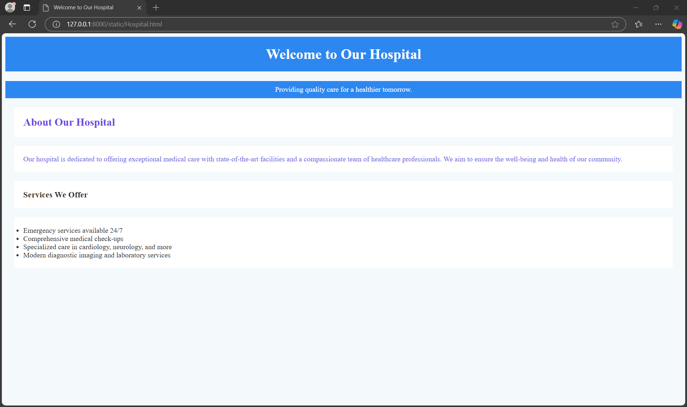
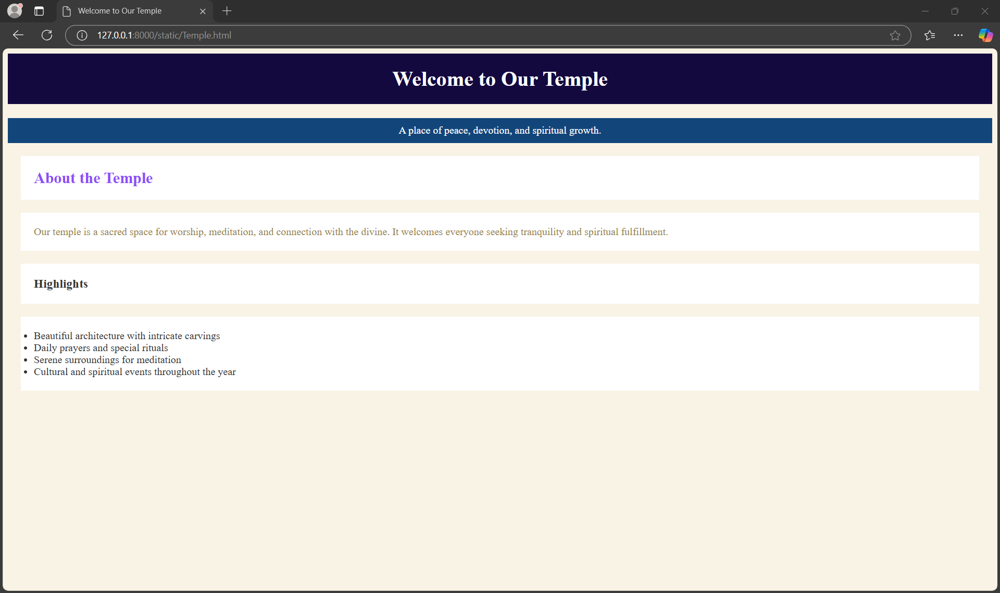
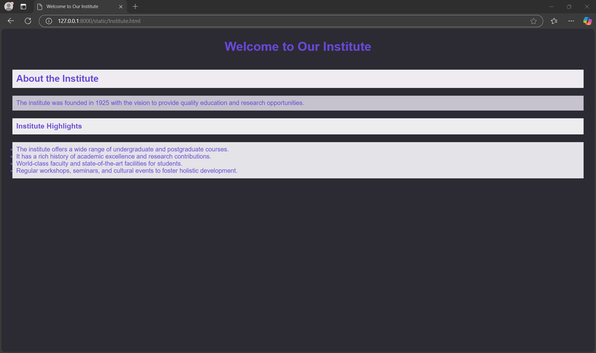
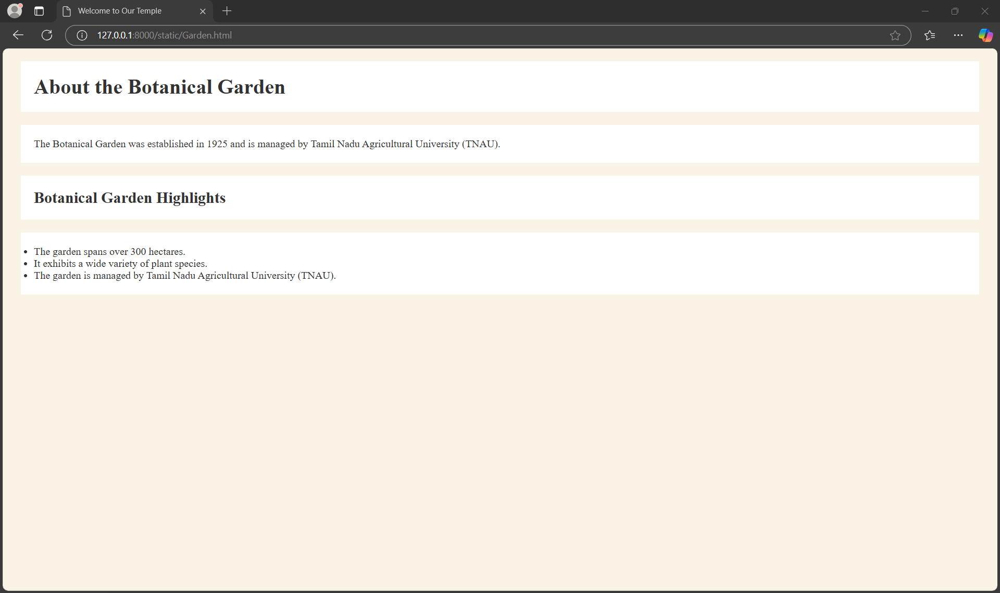

# Ex04 Places Around Me
## Date: 23-11-2024

## AIM
To develop a website to display details about the places around my house.

## DESIGN STEPS

### STEP 1
Create a Django admin interface.

### STEP 2
Download your city map from Google.

### STEP 3
Using ```<map>``` tag name the map.

### STEP 4
Create clickable regions in the image using ```<area>``` tag.

### STEP 5
Write HTML programs for all the regions identified.

### STEP 6
Execute the programs and publish them.

## CODE
```
map.html 

<html>
    <head>
        <title>
            Neyveli
        </title>
    </head>

    <body>
        <h1 align="right" style="color: blue;">
            Coimbatore
        </h1>
        <h2 align="left" style="color: red;">
            Shyam Kumar 24001160
        </h2>\
        
        <map name="MyCity">
            <area target="" alt="Botanical Garden" title="Botanical Garden" Garden.html="" coords="77,314,204,419" shape="rect">
            <area target="" alt="Car Museum" title="Car Museum" Museum.html="" coords="1066,490,1259,554" shape="rect">
            <area target="" alt="Samara Institute" title="Samara Institute" Institute.html="" coords="650,110,789,185" shape="rect">
            <area target="" alt="Ayyappan Temple" title="Ayyappan Temple" Temple.html="" coords="828,227,1020,267" shape="rect">
            <area target="" alt="Ganga Hospital" title="Ganga Hospital" Hospital.html="" coords="460,120,602,159" shape="rect">
        </map>
    </body>
</html>

Hospital.html

<html>
<head>
    <title>Welcome to Our Hospital</title>
</head>
<body style="background-color: #f4f9fc; color: #333; text-align: left;">
    <h1 style="background-color: #2d87f0; color: white; text-align: center; padding: 20px;">Welcome to Our Hospital</h1>
    <p style="background-color: #2d87f0; color: white; text-align: center; padding: 10px;">Providing quality care for a healthier tomorrow.</p>
    
    <h2 style="background-color: white; color: #6d4ae1; text-align: left; margin: 20px; padding: 20px;">About Our Hospital</h2>
    <p style="background-color: white; color: #6b5be4; text-align: left; margin: 20px; padding: 20px;">Our hospital is dedicated to offering exceptional medical care with state-of-the-art facilities and a compassionate team of healthcare professionals. We aim to ensure the well-being and health of our community.</p>
        
    <h3 style="background-color: white; color: #333; text-align: left; margin: 20px; padding: 20px;">Services We Offer</h3>
    <ul style="background-color: white; color: #333; text-align: left; margin: 20px; padding: 20px;">
        <li>Emergency services available 24/7</li>
        <li>Comprehensive medical check-ups</li>
        <li>Specialized care in cardiology, neurology, and more</li>
        <li>Modern diagnostic imaging and laboratory services</li>
    </ul>
</body>
</html>

Temple.html

<html>
<head>
    <title>Welcome to Our Temple</title>
</head>
<body style="background-color: #f9f3e6; color: #333; text-align: left;">
    <h1 style="background-color: #13093e; color: white; text-align: center; padding: 20px;">Welcome to Our Temple</h1>
    <p style="background-color: #12467a; color: white; text-align: center; padding: 10px;">A place of peace, devotion, and spiritual growth.</p>
    <h2 style="background-color: white; color: #8d4ef8; text-align: left; margin: 20px; padding: 20px;">About the Temple</h2>
    <p style="background-color: white; color: #97844a; text-align: left; margin: 20px; padding: 20px;">Our temple is a sacred space for worship, meditation, and connection with the divine. It welcomes everyone seeking tranquility and spiritual fulfillment.</p>
    
    <h3 style="background-color: white; color: #333; text-align: left; margin: 20px; padding: 20px;">Highlights</h3>
    <ul style="background-color: white; color: #333; text-align: left; margin: 20px; padding: 20px;">
        <li>Beautiful architecture with intricate carvings</li>
        <li>Daily prayers and special rituals</li>
        <li>Serene surroundings for meditation</li>
        <li>Cultural and spiritual events throughout the year</li>
    </ul>
</body>
</html>

Institute.html

<html>
<head>
    <title>Welcome to Our Institute</title>
</head>
<body style="background-color: #2c2b33; color: #6a49d6; text-align: left; font-family: Arial, sans-serif;">

    <h1 style="text-align: center; padding: 20px;">Welcome to Our Institute</h1>
    <h2 style="margin: 20px; padding: 10px; background-color: rgb(238, 236, 241);">About the Institute</h2>
    <p style="margin: 20px; padding: 10px; background-color: rgb(198, 194, 206);">
        The institute was founded in 1925 with the vision to provide quality education and research opportunities.
    </p>

    <h3 style="margin: 20px; padding: 10px; background-color: rgb(237, 237, 239);">Institute Highlights</h3>
    <ul style="margin: 20px; padding: 10px; background-color: rgb(228, 227, 232);">
        <li>The institute offers a wide range of undergraduate and postgraduate courses.</li>
        <li>It has a rich history of academic excellence and research contributions.</li>
        <li>World-class faculty and state-of-the-art facilities for students.</li>
        <li>Regular workshops, seminars, and cultural events to foster holistic development.</li>
    </ul>

</body>
</html>

Museum.html

<html>
<head>
    <title>Welcome to Museum</title>
</head>
<body style="background-color: #c6a766; color: #5b4e95; text-align: left;"></body>

    <h2 style="background-color: white; color: #333; text-align: left; margin: 20px; padding: 20px;">About the Museum</h2>
    <p style="background-color: white; color: #333; text-align: left; margin: 20px; padding: 20px;">The museum was founded in 2015 by G.D. Gopal in memory of his late father, Gopalswamy Doraiswamy Naidu.</p>
    <h3 style="background-color: white; color: #333; text-align: left; margin: 20px; padding: 20px;">Museum Highlights</h3>
    <ul style="background-color: white; color: #333; text-align: left; margin: 20px; padding: 20px;">
        <li>The museum showcases a collection of automobiles from Britain, Germany, Japan, France, Spain, and the U.S.</li>
        <li>The collection features nearly 35 different brands of cars.</li>
        <li>The vehicles are part of G.D. Naidu Charities, which has been collecting cars for over 40 years.</li>
        <li>It also received eight vintage cars donated by other enthusiasts.</li>
    </ul>
</body>
</html>

Garden.html

<html>
<head>
    <title>Welcome to Our Temple</title>
</head>
<body style="background-color: #f9f3e6; color: #333; text-align: left;">
    <h1 style="background-color: white; color: #333; text-align: left; margin: 20px; padding: 20px;">About the Botanical Garden</h1>
    <p style="background-color: white; color: #333; text-align: left; margin: 20px; padding: 20px;">The Botanical Garden was established in 1925 and is managed by Tamil Nadu Agricultural University (TNAU).</p>
    <h2 style="background-color: white; color: #333; text-align: left; margin: 20px; padding: 20px;">Botanical Garden Highlights</h2>
    <ul style="background-color: white; color: #333; text-align: left; margin: 20px; padding: 20px;">
        <li>The garden spans over 300 hectares.</li>
        <li>It exhibits a wide variety of plant species.</li>
        <li>The garden is managed by Tamil Nadu Agricultural University (TNAU).</li>
    </ul>
</body>
</html>

```

## OUTPUT








## RESULT
The program for implementing image maps using HTML is executed successfully.
